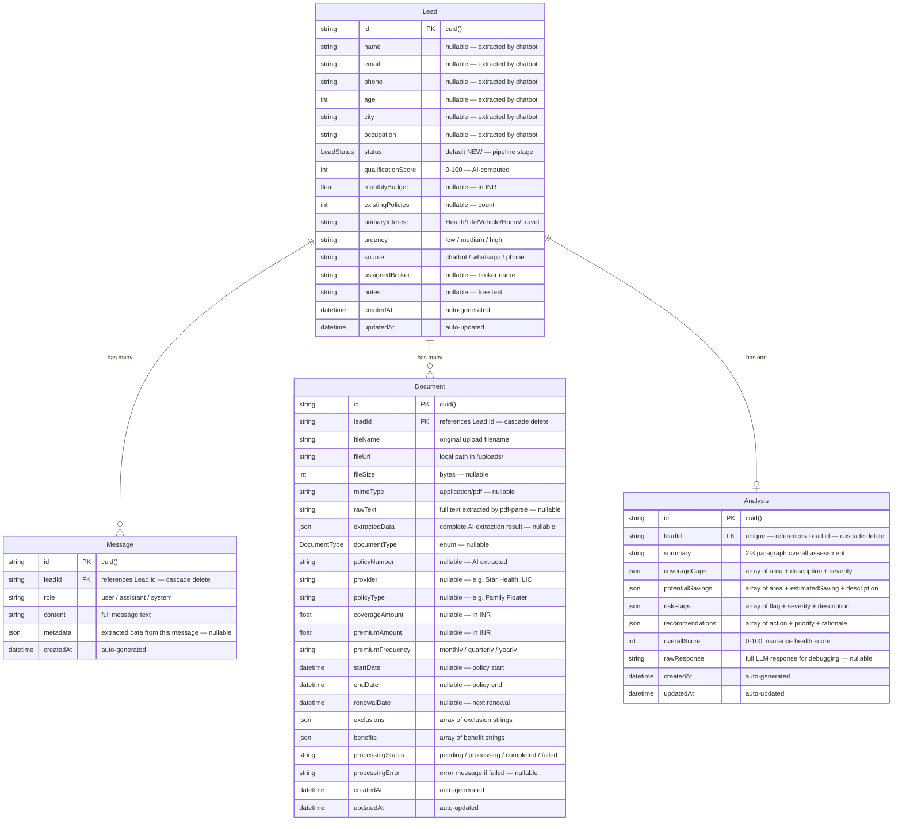
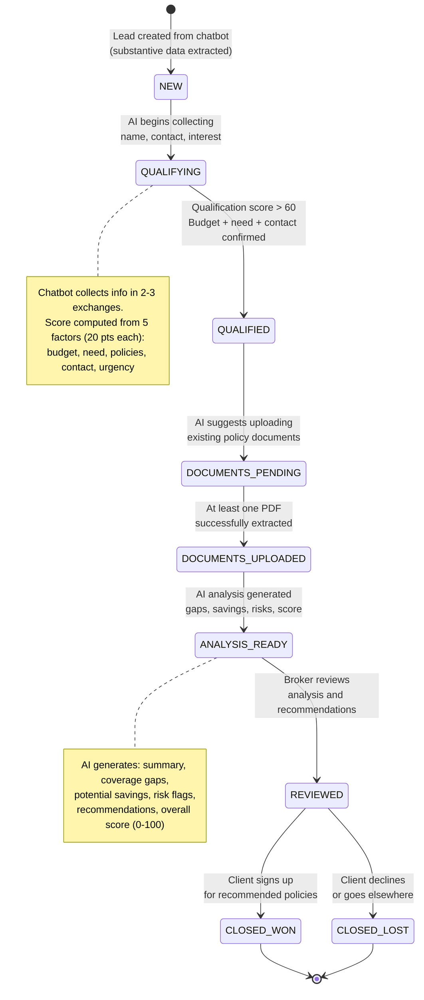
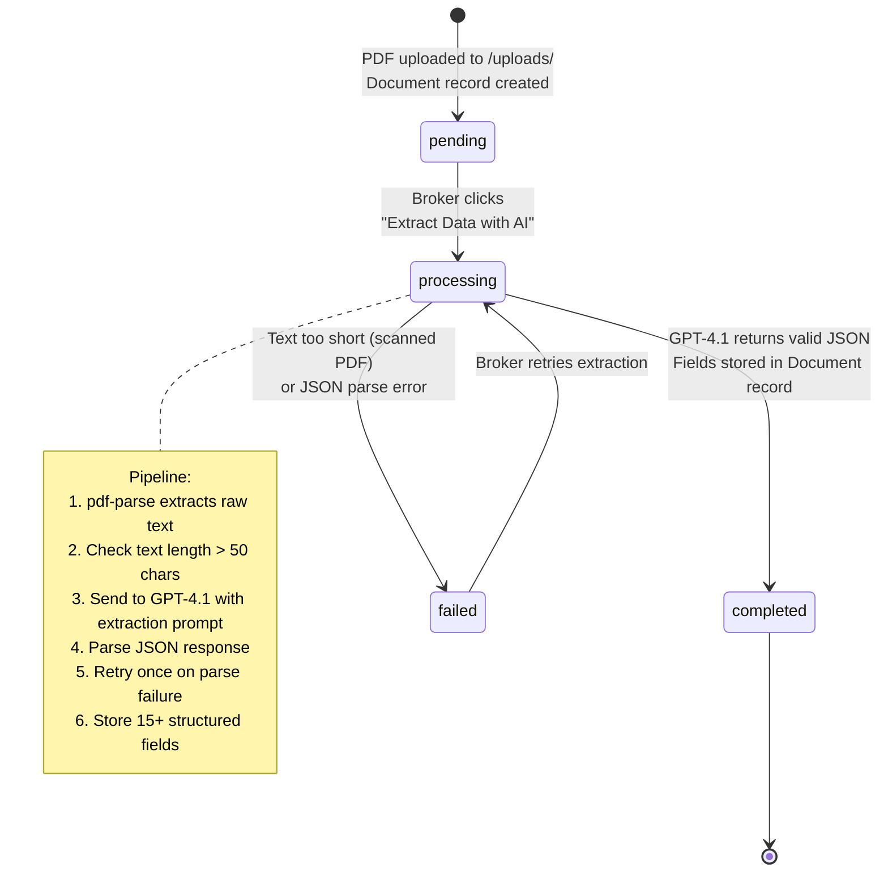

# Entity Relationship Diagram

## Database Schema



## Lead Status State Machine



## Document Processing States



## Enum Values

### LeadStatus
| Value | Color | Meaning |
|---|---|---|
| `NEW` | Gray | Just created, minimal data |
| `QUALIFYING` | Blue | Chatbot actively collecting info |
| `QUALIFIED` | Indigo | Score > 60, ready for next step |
| `DOCUMENTS_PENDING` | Amber | Awaiting document upload |
| `DOCUMENTS_UPLOADED` | Teal | At least one doc extracted |
| `ANALYSIS_READY` | Emerald | AI analysis complete |
| `REVIEWED` | Purple | Broker has reviewed |
| `CLOSED_WON` | Green | Deal closed successfully |
| `CLOSED_LOST` | Red | Deal lost |

### DocumentType
| Value | Description |
|---|---|
| `HEALTH_INSURANCE` | Mediclaim, family floater, critical illness, top-up |
| `LIFE_INSURANCE` | Term plan, endowment, ULIP, whole life |
| `VEHICLE_INSURANCE` | Car, two-wheeler, commercial (comprehensive or third-party) |
| `HOME_INSURANCE` | Structure, contents, fire, natural disaster |
| `TRAVEL_INSURANCE` | Domestic, international, student |
| `OTHER` | Any other insurance document |

## JSON Field Structures

### Document.extractedData
```json
{
  "documentType": "HEALTH_INSURANCE",
  "policyNumber": "POL-2024-12345",
  "provider": "Star Health Insurance",
  "policyType": "Family Floater",
  "insuredName": "Aarav Shukla",
  "coverageAmount": 500000,
  "premiumAmount": 12000,
  "premiumFrequency": "yearly",
  "startDate": "2024-01-15",
  "endDate": "2025-01-14",
  "renewalDate": "2025-01-14",
  "exclusions": ["Pre-existing diseases (48 months)", "Cosmetic surgery", "Dental treatment"],
  "benefits": ["Hospitalization", "Day care procedures", "Ambulance charges", "Pre/post hospitalization"],
  "deductible": 5000,
  "nominees": ["Priya Shukla"],
  "additionalNotes": "No-claim bonus of 20% applicable on renewal"
}
```

### Analysis.coverageGaps
```json
[
  {
    "area": "Critical Illness Cover",
    "description": "No standalone critical illness policy despite family history of cardiac issues. Current health policy covers hospitalization but not lump-sum CI payouts.",
    "severity": "high"
  },
  {
    "area": "Life Insurance",
    "description": "No term life policy. As a 23-year-old software engineer, premiums would be very affordable now.",
    "severity": "critical"
  }
]
```

### Analysis.potentialSavings
```json
[
  {
    "area": "Health Insurance Premium",
    "estimatedSaving": "₹4,500/year",
    "description": "Switch from individual plan to family floater — covers spouse at marginal cost increase"
  }
]
```

### Analysis.recommendations
```json
[
  {
    "action": "Purchase a ₹1 crore term life policy",
    "priority": "immediate",
    "rationale": "At age 23, premiums are under ₹800/month. Provides financial security for dependents."
  },
  {
    "action": "Add a super top-up of ₹25 lakh",
    "priority": "short-term",
    "rationale": "Base cover of ₹5 lakh is insufficient for major hospitalization in metro cities."
  }
]
```
