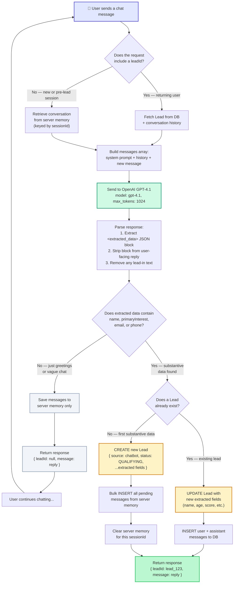
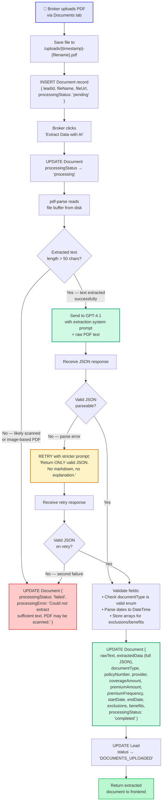

# Lead Capture to Analysis Pipeline — Sequence & Flow Diagrams

## End-to-End Sequence Diagram

```mermaid
sequenceDiagram
    actor User as 👤 Prospective Client
    participant Chat as Chat UI<br/>(/chat)
    participant ChatAPI as Chat API<br/>(POST /api/chat)
    participant Memory as Server Memory<br/>(pre-lead sessions)
    participant GPT as OpenAI GPT-4.1
    participant DB as Supabase<br/>PostgreSQL
    participant Dashboard as Dashboard UI<br/>(/dashboard)
    actor Broker as 🧑‍💼 Insurance Broker

    rect rgba(224, 231, 255, 0.3)
        Note over User, DB: 📋 Phase 1 — Lead Qualification via AI Chatbot

        User->>Chat: Opens /chat
        Note over Chat: Welcome screen shown<br/>with 3 suggestion chips

        User->>Chat: "Hi, I need health insurance"
        Chat->>ChatAPI: { message: "Hi, I need health insurance", sessionId: "sess_abc" }
        ChatAPI->>Memory: Initialize session "sess_abc"
        ChatAPI->>GPT: System prompt (insurance advisor persona)<br/>+ user message
        GPT-->>ChatAPI: Conversational reply<br/>+ <extracted_data> { primaryInterest: "Health Insurance" }
        ChatAPI->>ChatAPI: Parse <extracted_data> block<br/>Strip from user-facing reply
        Note over ChatAPI: primaryInterest found → substantive data!
        ChatAPI->>DB: INSERT Lead { source: "chatbot", status: "QUALIFYING",<br/>primaryInterest: "Health Insurance" }
        ChatAPI->>DB: INSERT Messages (user + assistant)
        Memory-->>Memory: Clear session "sess_abc"
        ChatAPI-->>Chat: { leadId: "lead_123", message: "Welcome! I'd love to help..." }
        Chat->>Chat: Store leadId in localStorage
        Chat-->>User: Display AI greeting with follow-up questions

        User->>Chat: "I'm Aarav, 23, software engineer in Kanpur.<br/>Budget around ₹1000/month, no existing policies"
        Chat->>ChatAPI: { leadId: "lead_123", message: "...", sessionId: "sess_abc" }
        ChatAPI->>DB: Fetch conversation history for lead_123
        ChatAPI->>GPT: System prompt + full history + new message
        GPT-->>ChatAPI: Summary reply + <extracted_data> {<br/>  name: "Aarav", age: 23, city: "Kanpur",<br/>  occupation: "Software Engineer",<br/>  monthlyBudget: 1000, existingPolicies: 0,<br/>  qualificationScore: 80, statusUpdate: "QUALIFIED"<br/>}
        ChatAPI->>ChatAPI: Parse extracted data, strip from reply
        ChatAPI->>DB: INSERT Messages (user + assistant)
        ChatAPI->>DB: UPDATE Lead {<br/>  name, age, city, occupation,<br/>  monthlyBudget, existingPolicies,<br/>  qualificationScore: 80, status: "QUALIFIED"<br/>}
        ChatAPI-->>Chat: { message: "Great Aarav! Here's what I'd suggest..." }
        Chat-->>User: Display summary + suggestion to upload documents
    end

    rect rgba(254, 249, 195, 0.3)
        Note over Broker, DB: 📄 Phase 2 — Document Upload & AI Extraction

        Broker->>Dashboard: Opens /dashboard
        Dashboard->>DB: GET /api/leads
        DB-->>Dashboard: Lead list including "Aarav" (QUALIFIED, score: 80)
        Broker->>Dashboard: Clicks Aarav's lead card
        Dashboard->>DB: GET /api/leads/lead_123 (with all relations)
        DB-->>Dashboard: Full lead detail (info, conversations, documents, analysis)

        Broker->>Dashboard: Switches to Documents tab
        Broker->>Dashboard: Clicks "Upload PDF" → selects health_policy.pdf
        Dashboard->>ChatAPI: POST /api/documents/upload<br/>FormData { file: health_policy.pdf, leadId: "lead_123" }
        ChatAPI->>ChatAPI: Save PDF to /uploads/1234-health_policy.pdf
        ChatAPI->>DB: INSERT Document {<br/>  leadId: "lead_123", fileName: "health_policy.pdf",<br/>  fileUrl: "/uploads/1234-health_policy.pdf",<br/>  processingStatus: "pending"<br/>}
        ChatAPI-->>Dashboard: Document record with id: "doc_456"
        Dashboard-->>Broker: Show document card with "pending" badge

        Broker->>Dashboard: Clicks "Extract Data with AI"
        Dashboard->>ChatAPI: POST /api/documents/doc_456/extract
        ChatAPI->>DB: UPDATE Document { processingStatus: "processing" }
        ChatAPI->>ChatAPI: pdf-parse reads /uploads/1234-health_policy.pdf
        ChatAPI->>ChatAPI: Extract raw text (e.g., 3,200 chars)
        Note over ChatAPI: Text length > 50 chars ✓ Proceed

        ChatAPI->>GPT: Extraction system prompt<br/>+ "Here is the text extracted from an insurance document:<br/>---<br/>[raw PDF text]<br/>---"
        GPT-->>ChatAPI: JSON response {<br/>  documentType: "HEALTH_INSURANCE",<br/>  policyNumber: "POL-2024-12345",<br/>  provider: "Star Health Insurance",<br/>  coverageAmount: 500000,<br/>  premiumAmount: 12000,<br/>  premiumFrequency: "yearly",<br/>  exclusions: [...], benefits: [...]<br/>}
        ChatAPI->>ChatAPI: Validate JSON, check field types
        ChatAPI->>DB: UPDATE Document {<br/>  extractedData: {...}, documentType: "HEALTH_INSURANCE",<br/>  policyNumber, provider, coverageAmount, premiumAmount,<br/>  exclusions, benefits, processingStatus: "completed"<br/>}
        ChatAPI->>DB: UPDATE Lead { status: "DOCUMENTS_UPLOADED" }
        ChatAPI-->>Dashboard: Updated document with all extracted fields
        Dashboard-->>Broker: Show extracted policy details (provider, coverage, premium, etc.)
    end

    rect rgba(220, 252, 231, 0.3)
        Note over Broker, DB: 📈 Phase 3 — AI Analysis Generation

        Broker->>Dashboard: Switches to Analysis tab
        Broker->>Dashboard: Clicks "Generate Analysis"
        Dashboard->>ChatAPI: POST /api/analysis/lead_123

        ChatAPI->>DB: Fetch Lead { name, age, city, occupation,<br/>primaryInterest, monthlyBudget, existingPolicies, urgency }
        ChatAPI->>DB: Fetch Documents where leadId = "lead_123"<br/>AND processingStatus = "completed"
        ChatAPI->>ChatAPI: Aggregate lead profile + all extracted document data

        ChatAPI->>GPT: Analyst system prompt<br/>+ "CLIENT PROFILE:<br/>{lead data}<br/><br/>EXISTING DOCUMENTS:<br/>{documents data}"
        GPT-->>ChatAPI: Analysis JSON {<br/>  summary: "Aarav is a 23-year-old software engineer...",<br/>  coverageGaps: [<br/>    { area: "Critical Illness", severity: "high" },<br/>    { area: "Life Insurance", severity: "critical" }<br/>  ],<br/>  potentialSavings: [<br/>    { area: "Premium", estimatedSaving: "₹4,500/year" }<br/>  ],<br/>  riskFlags: [<br/>    { flag: "No life cover", severity: "critical" }<br/>  ],<br/>  recommendations: [<br/>    { action: "₹1Cr term plan", priority: "immediate" }<br/>  ],<br/>  overallScore: 42<br/>}

        ChatAPI->>DB: UPSERT Analysis {<br/>  leadId: "lead_123",<br/>  summary, coverageGaps, potentialSavings,<br/>  riskFlags, recommendations, overallScore: 42,<br/>  rawResponse: JSON.stringify(fullResponse)<br/>}
        ChatAPI->>DB: UPDATE Lead { status: "ANALYSIS_READY" }
        ChatAPI-->>Dashboard: Full analysis data
        Dashboard-->>Broker: Display analysis with:<br/>• Score ring (42/100 — amber)<br/>• Coverage gaps with severity badges<br/>• Savings in emerald cards<br/>• Risk flags with colored borders<br/>• Prioritized recommendations
    end

    rect rgba(243, 232, 255, 0.3)
        Note over Broker, DB: ✅ Phase 4 — Broker Review & Close

        Broker->>Broker: Reviews analysis, prepares recommendations
        Broker->>Dashboard: Changes status to REVIEWED via dropdown
        Dashboard->>DB: PATCH /api/leads/lead_123 { status: "REVIEWED" }

        Broker->>Broker: Contacts Aarav with tailored insurance recommendations
        Note over Broker: Recommends: ₹1Cr term plan + ₹25L super top-up<br/>+ critical illness rider

        Broker->>Dashboard: Changes status to CLOSED_WON
        Dashboard->>DB: PATCH /api/leads/lead_123 { status: "CLOSED_WON" }
        Dashboard-->>Broker: Lead moves to "Won" column in pipeline
    end
```

## Lead Creation Decision Flow

## Document Extraction Pipeline

## Timeline — Typical Lead Journey

| Step | Elapsed Time | Lead Status | AI Involved? |
|---|---|---|---|
| User opens /chat, sends first message | 0 min | No lead yet | Yes — GPT-4.1 chatbot |
| User shares name + insurance interest | ~1 min | `NEW` → `QUALIFYING` | Yes — data extraction |
| User provides contact, budget, details | ~3 min | `QUALIFYING` → `QUALIFIED` | Yes — score computation |
| Broker reviews lead on dashboard | ~5 min | `QUALIFIED` | No |
| Broker uploads existing policy PDF | ~6 min | `DOCUMENTS_PENDING` | No |
| AI extracts policy data from PDF | +30 seconds | `DOCUMENTS_UPLOADED` | Yes — GPT-4.1 extractor |
| AI generates coverage analysis | +15 seconds | `ANALYSIS_READY` | Yes — GPT-4.1 analyzer |
| Broker reviews analysis & recommendations | ~15 min | `REVIEWED` | No |
| Broker contacts client, closes deal | varies | `CLOSED_WON` | No |

**Total AI processing time: under 1 minute**
**Traditional manual process: 2-3 days**
