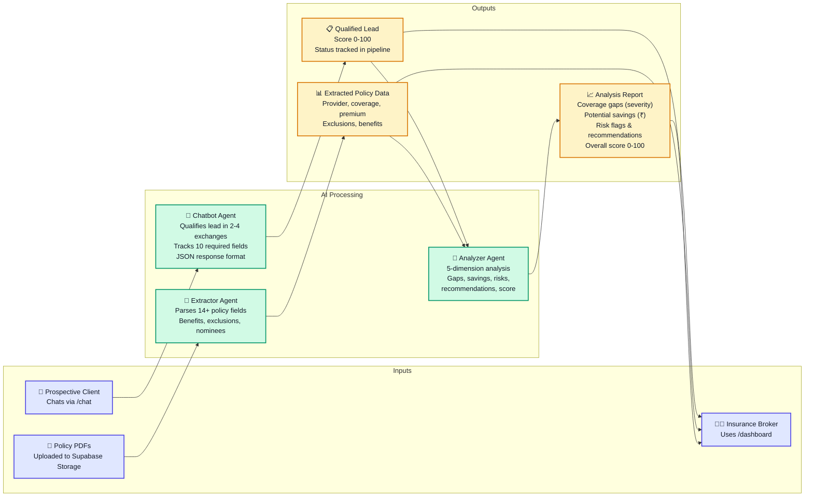

# System Architecture Diagram

## High-Level Architecture

```mermaid
graph TB
    subgraph Client["🖥️ Frontend — Browser"]
        direction LR
        LP["Landing Page<br/><code>/</code>"]
        CH["AI Chatbot<br/><code>/chat</code>"]
        LG["Login / Signup<br/><code>/login</code>"]
        DB["Dashboard<br/><code>/dashboard</code>"]
        LD["Lead Detail<br/><code>/dashboard/leads/[id]</code>"]
        LT["Leads Table<br/><code>/dashboard/leads</code>"]
        DT["Documents Table<br/><code>/dashboard/documents</code>"]
    end

    subgraph Server["⚙️ Next.js 16 App Router — Vercel"]

        subgraph Auth["🔒 Auth & Route Guard"]
            direction LR
            Proxy["<b>proxy.ts</b><br/>Route protection layer"]
            SupaAuth["<b>Supabase Auth</b><br/>@supabase/ssr<br/>Cookie-based sessions"]
        end

        subgraph API["API Routes"]
            direction LR
            ChatAPI["<b>Chat API</b><br/>POST /api/chat<br/>GET /api/chat/history<br/>GET /api/chat/[leadId]"]
            LeadsAPI["<b>Leads API</b><br/>GET /api/leads<br/>GET /api/leads/[id]<br/>PATCH /api/leads/[id]<br/>DELETE /api/leads/[id]"]
            DocsAPI["<b>Documents API</b><br/>GET /api/documents<br/>POST /api/documents/upload<br/>POST /api/documents/[id]/extract"]
            AnalysisAPI["<b>Analysis API</b><br/>GET /api/analysis/[leadId]<br/>POST /api/analysis/[leadId]"]
        end

        subgraph AILayer["🤖 AI Orchestration Layer"]
            direction LR
            Chatbot["<b>Chatbot Agent</b><br/>chatbot.ts<br/>Lead qualification via<br/>natural conversation"]
            Extractor["<b>Extractor Agent</b><br/>extractor.ts<br/>PDF → structured<br/>policy data"]
            Analyzer["<b>Analyzer Agent</b><br/>analyzer.ts<br/>Coverage gaps, savings,<br/>risk flags, recommendations"]
        end

        subgraph Utilities["🔧 Utilities"]
            direction LR
            PDFParser["<b>PDF Parser</b><br/>pdf-parse v2<br/>Text extraction from PDF"]
            PrismaClient["<b>Prisma ORM v7</b><br/>@prisma/adapter-pg<br/>Type-safe DB access"]
        end
    end

    subgraph External["☁️ External Services"]
        direction LR
        OpenAI["<b>OpenAI API</b><br/>GPT-4.1<br/>All LLM inference"]
        Supabase["<b>Supabase</b><br/>PostgreSQL<br/>Session pooler"]
        SupaStore["<b>Supabase Storage</b><br/>documents bucket<br/>PDF files"]
        SupaAuthSvc["<b>Supabase Auth</b><br/>Auth service<br/>User management"]
    end

    %% Auth flow
    LG -->|"login/signup"| SupaAuth
    SupaAuth -->|"verify session"| SupaAuthSvc
    DB & LT & LD & DT -->|"all requests"| Proxy
    Proxy -->|"authenticated"| API
    Proxy -->|"unauthenticated"| LG

    %% Frontend → API (public)
    CH -->|"send message<br/>receive AI reply"| ChatAPI

    %% API → AI
    ChatAPI -->|"conversation history<br/>+ lead state + message"| Chatbot
    DocsAPI -->|"raw PDF text"| Extractor
    AnalysisAPI -->|"lead profile<br/>+ extracted docs"| Analyzer

    %% AI → OpenAI
    Chatbot -->|"chat.completions.create<br/>JSON response format"| OpenAI
    Extractor -->|"chat.completions.create"| OpenAI
    Analyzer -->|"chat.completions.create"| OpenAI

    %% API → Data
    ChatAPI --> PrismaClient
    LeadsAPI --> PrismaClient
    DocsAPI --> PrismaClient
    DocsAPI --> PDFParser
    AnalysisAPI --> PrismaClient

    %% Data → External
    PrismaClient -->|"session pooler<br/>port 5432"| Supabase
    DocsAPI -->|"upload PDF"| SupaStore
    PDFParser -->|"fetch PDF"| SupaStore

    %% Styling
    classDef frontend fill:#e0e7ff,stroke:#4f46e5,stroke-width:2px,color:#111827
    classDef authStyle fill:#fce7f3,stroke:#ec4899,stroke-width:2px,color:#111827
    classDef api fill:#fef3c7,stroke:#d97706,stroke-width:2px,color:#111827
    classDef ai fill:#d1fae5,stroke:#059669,stroke-width:2px,color:#111827
    classDef external fill:#e0f2fe,stroke:#0ea5e9,stroke-width:2px,color:#111827
    classDef util fill:#f1f5f9,stroke:#64748b,stroke-width:2px,color:#111827

    class LP,CH,LG,DB,LD,LT,DT frontend
    class Proxy,SupaAuth authStyle
    class ChatAPI,LeadsAPI,DocsAPI,AnalysisAPI api
    class Chatbot,Extractor,Analyzer ai
    class OpenAI,Supabase,SupaStore,SupaAuthSvc external
    class PDFParser,PrismaClient util
```

## Data Flow Summary

## Component Responsibilities

| Layer | Component | Responsibility |
|---|---|---|
| **Frontend** | Landing Page (`/`) | Feature showcase, animated hero, workflow steps, auth-aware CTAs |
| **Frontend** | AI Chatbot (`/chat`) | Conversational lead qualification, chat history sidebar, session persistence |
| **Frontend** | Login / Signup (`/login`) | Broker authentication via Supabase Auth (email/password) |
| **Frontend** | Dashboard (`/dashboard`) | Pipeline kanban board, stats cards (total, qualified, won, avg score) |
| **Frontend** | Lead Detail (`/dashboard/leads/[id]`) | Tabbed view: overview, conversation, documents, analysis |
| **Frontend** | Leads Table (`/dashboard/leads`) | Searchable, filterable list of all leads with status badges |
| **Frontend** | Documents Table (`/dashboard/documents`) | All uploaded documents across leads with extraction status |
| **Auth** | `proxy.ts` | Next.js 16 route guard — protects `/dashboard/*` and sensitive APIs |
| **Auth** | Supabase Auth (`@supabase/ssr`) | Cookie-based session management, server/client helpers |
| **API** | Chat Routes | Message handling, lead state injection, deferred lead creation, stateless pending history |
| **API** | Lead Routes | Full CRUD operations on leads with cascade delete |
| **API** | Document Routes | PDF upload to Supabase Storage, AI extraction trigger |
| **API** | Analysis Routes | AI analysis generation/regeneration, upsert to DB |
| **API** | Auth Routes | Logout endpoint (`POST /api/auth/logout`) |
| **AI** | Chatbot Agent | Lead qualification + JSON data extraction (`response_format: json_object`), 10 required fields tracked |
| **AI** | Extractor Agent | PDF raw text → structured policy JSON (14+ fields: policy details, benefits, exclusions, nominees) |
| **AI** | Analyzer Agent | Lead profile + all documents → 5-dimension analysis: gaps, savings, risks, recommendations, score |
| **Data** | Prisma v7 + pg adapter | Type-safe PostgreSQL access via Supabase session pooler |
| **Data** | pdf-parse v2 | PDF binary → raw text extraction (`Uint8Array` input) |
| **External** | OpenAI GPT-4.1 | All LLM inference (chatbot, extraction, analysis) |
| **External** | Supabase PostgreSQL | Persistent storage for leads, messages, documents, analyses |
| **External** | Supabase Storage | PDF document storage (`documents` bucket) |
| **External** | Supabase Auth Service | User management, session verification |