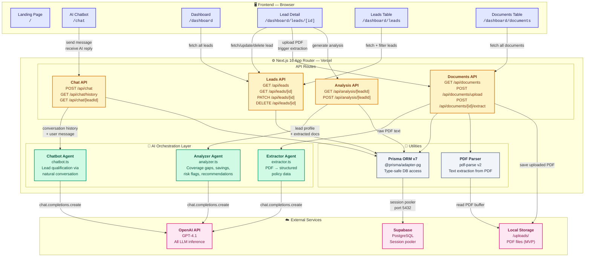
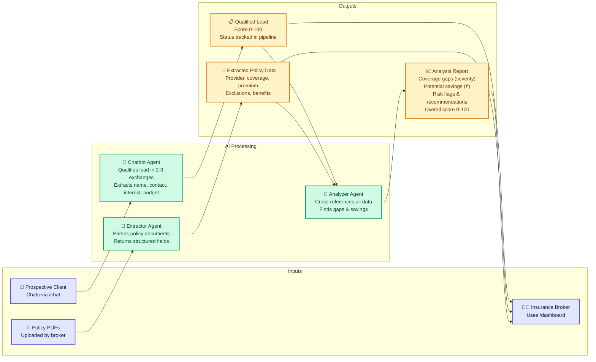

# System Architecture Diagram

## High-Level Architecture

## Data Flow Summary

## Component Responsibilities

| Layer | Component | Responsibility |
|---|---|---|
| **Frontend** | Landing Page (`/`) | Marketing, feature showcase, onboarding CTAs |
| **Frontend** | AI Chatbot (`/chat`) | Real-time conversation with lead, chat history sidebar, session persistence |
| **Frontend** | Dashboard (`/dashboard`) | Pipeline kanban board, stats cards (total, qualified, won, avg score) |
| **Frontend** | Lead Detail (`/dashboard/leads/[id]`) | Full lead view with tabs: info, conversation, documents, analysis |
| **Frontend** | Leads Table (`/dashboard/leads`) | Searchable, filterable list of all leads |
| **Frontend** | Documents Table (`/dashboard/documents`) | All uploaded documents across leads with status |
| **API** | Chat Routes | Message handling, deferred lead creation, session memory, conversation persistence |
| **API** | Lead Routes | Full CRUD operations on leads with cascade delete |
| **API** | Document Routes | PDF upload to local storage, AI extraction trigger with retry |
| **API** | Analysis Routes | AI analysis generation/regeneration, upsert to DB |
| **AI** | Chatbot Agent | Conversational lead qualification + structured data extraction via `<extracted_data>` blocks |
| **AI** | Extractor Agent | PDF raw text → structured policy JSON (policy #, provider, coverage, premium, dates, exclusions, benefits) |
| **AI** | Analyzer Agent | Lead profile + all documents → coverage gaps, savings, risk flags, recommendations, overall score |
| **Data** | Prisma v7 + pg adapter | Type-safe PostgreSQL access via Supabase session pooler |
| **Data** | pdf-parse v2 | PDF binary → raw text extraction |
| **External** | OpenAI GPT-4.1 | All LLM inference (chatbot, extraction, analysis) |
| **External** | Supabase PostgreSQL | Persistent storage for leads, messages, documents, analyses |
| **External** | Local /uploads/ | PDF file storage (MVP; production would use Supabase Storage) |
